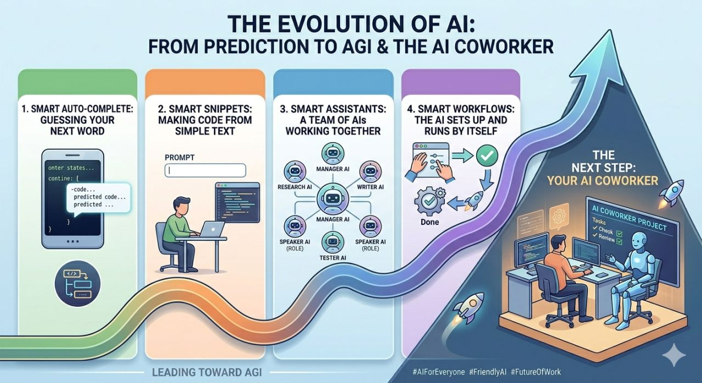

# AI CoWorkers



AI has been moving through a clear sequence:

1. Smart autocomplete: guessing the next word in old-school Copilot.
2. Smart snippets: prompt engineering to generate code from simple text.
3. Smart assistants: teams of AI agents working together through harness engineering.
4. Smart workflows: autonomous loops and automations that run after we set them up.

Each phase is moving us closer to systems that feel less like tools and more like capable collaborators.

The next step is the **AI Coworker**.

This project starts with a focused coworker: an AI Scrum Master for engineering teams that use Jira. The goal is not to make a generic chatbot. The goal is to build a coworker that understands sprint ceremonies, Jira workflows, team goals, and delivery signals well enough to reduce repetitive coordination work.

## First Coworker: Scrum Master

The first AI coworker will focus on Scrum Master responsibilities that are high-context but repeatable:

- Sprint grooming and backlog readiness.
- Sprint planning and capacity alignment.
- Mid-sprint adjustments when scope, blockers, or priorities shift.
- Daily standup summaries and follow-ups.
- Milestone, sprint goal, and delivery risk tracking.
- Sprint retrospectives with action-item continuity.
- Jira-first workflows for issues, boards, sprints, epics, and status transitions.

## First Workflow: Sprint Planning

The first implemented workflow replaces the current Excel plus Jira sprint-planning loop.

Current manual flow:

1. Clone the previous sprint sheet, for example from `Q2S6 - 2026` to `Q2S7 - 2026`.
2. Carry forward sprint dates, working days excluding holidays, and holiday context.
3. Update the `-3`, `-2`, and `-1` sprint velocities.
4. Ask the team on Slack to update previous and upcoming sprint leaves.
5. Close the previous sprint in Jira.
6. Pull completed story points from Jira reporting.
7. Calculate average net velocity and let the team override it when confidence or spillover context supports a higher target.

The web app now starts with a Sprint Planning workbench for these inputs and outputs. Jira and Slack are represented as configurable team inputs today, with connector-backed automation planned next.

Current preview APIs:

- `GET /api/coworkers/scrum-master/sprint-planning/team-config/:teamKey`
- `POST /api/coworkers/scrum-master/sprint-planning/jira-reporting/import-preview`
- `POST /api/coworkers/scrum-master/sprint-planning/workflow-draft`

## Product Direction

The app is intentionally structured around Agoda-style Jira usage first, while keeping the core abstractions portable enough to support other engineering organizations later.

## Tech Stack

- Frontend: React with TypeScript.
- Backend: TypeScript API service.
- Package management: pnpm workspaces.
- Initial backend integration target: Jira.

## Repository Structure

```text
apps/
  api/   TypeScript backend service
  web/   React TypeScript frontend
docs/
  assets/
  database/
```

## Getting Started

```bash
pnpm install
pnpm dev
```

The web app runs on `http://localhost:5173` and the API runs on `http://localhost:4100` by default.

## Current Status

The repo contains the first sprint-planning workflow slice: a React workbench, a TypeScript API route, sprint velocity calculation, connector-ready action plan, Jira/Slack configuration placeholders, and a Postgres schema design for durable planning sessions.
